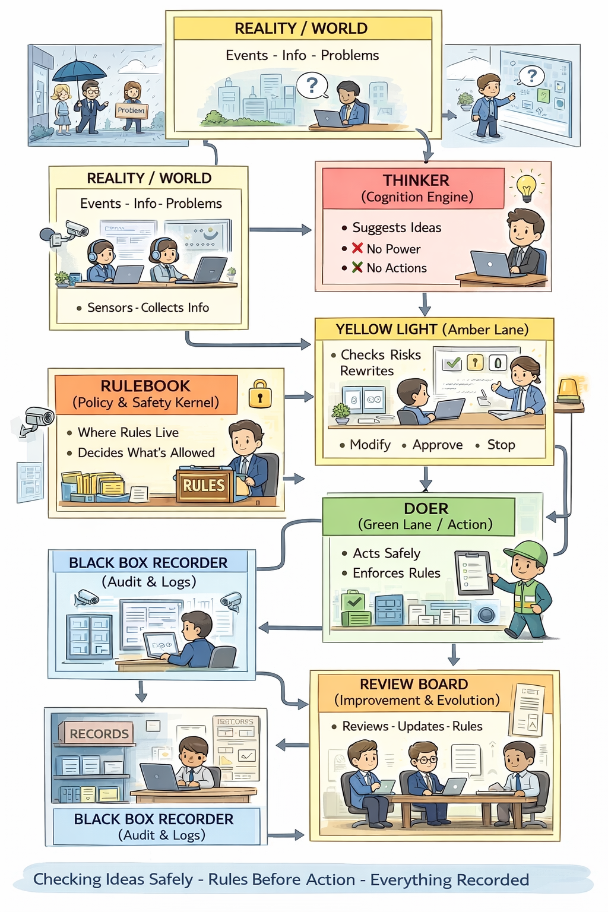

## 🧠 Zero-Trust Autonomous Runtime — Reference Architecture

**Figure 1 — Zero-Trust Autonomous Runtime**

This diagram shows the full end-to-end architecture of a zero-trust agent runtime.
Untrusted cognition proposes actions, structural governance constrains them,
the Policy & Safety Kernel mints scoped capability tokens, and only token-authorized
actions are allowed to execute. All side effects are auditable and revocable.
